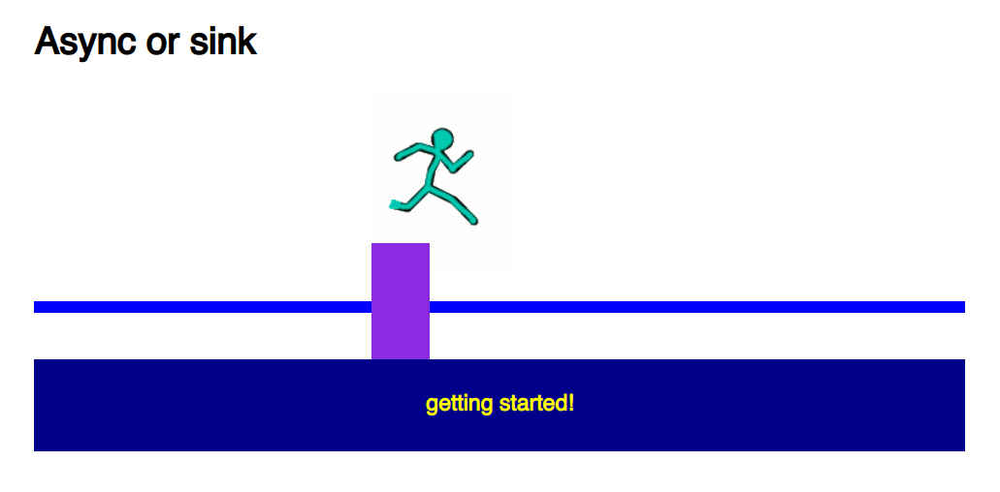

# Async or Sink (Beta)

**Prerequisites:**

Make sure that you have done your reading on how synchronous code runs vs. asynchronous code. 

**Learning Objectives**

 - Understand how to work with asynchronous code
 - Get comfortable with using callbacks, and nesting callback functions

## Getting started

 - Fork & Clone this Repo
 - Open the index.html file in your web browser
 - Open your browser inspector
 - Your work will be done in `app.js`
 - When you want to restart a round, just refresh the page
 - You are **not** allowed to use `setTimeout`, instead use the given `afterX` functions

The goal of this exercise is to keep the runner out of the water by staying on the moving platform!

You'll need to use the appropriate methods on the `runner` object in `app.js`.

Use the given `afterX` functions:

*Input:* Callback Function, runs the function after the number of miliseconds listed in the function name.
*Return:* Undefined

*Example usage:* 
`after300(function(){ runner.moveRight() })`  - Will make the runner run right after 300 miliseconds.

