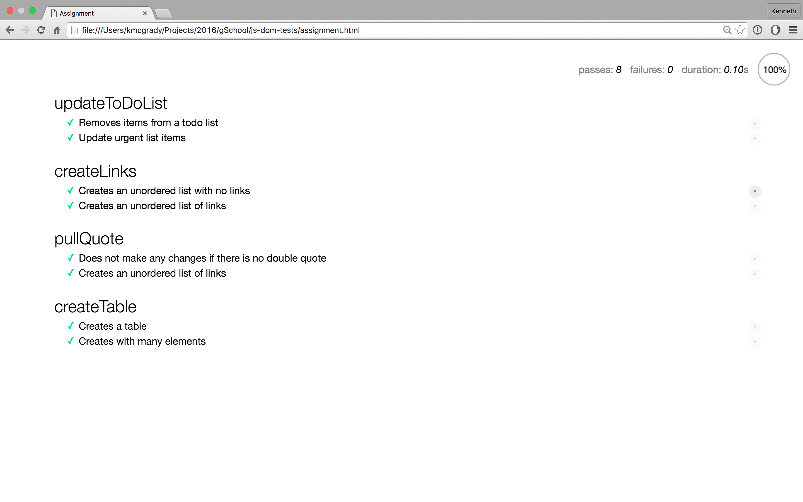

# JavaScript DOM Manipulation

In this exercise, you'll need to solve a set of increasingly difficult puzzles aimed at helping you master manipulating the DOM.

**TIP:** You're encouraged to use online documentation to lookup how to use unfamiliar concepts.

### Setup

To get started, download this code onto your machine by following these setup instructions.

1. Fork this repository to your own GitHub account.
1. Clone your forked repository to your development environment.
1. Open the repository's project directory in your text editor.
1. Open the `assignment.html` file in your web browser.

In your web browser, you'll see a page that shows a bunch of failing JavaScript tests. Locate the area that shows how many tests are passing and how many are failing.

### How to proceed

Your job is to make all these JavaScript tests pass by completing their respective puzzle.

1. Open the `assignment.js` file in your text editor.
1. Read the instructions for each puzzle.
1. Solve the puzzle by writing JavaScript.

Once it's ready, test your solution.

1. Tab over to the browser with `Command + Tab`.
1. Refresh the browser with `Command + R`.
1. Scroll to the puzzle's test and see if it's still red.
1. Once the test is green, you've solved the puzzle.

You can see how each test invokes the puzzle's function by clicking on the test description.

### Wrestle with it

You may encounter challenges that seem confusing or impossible. Don't despair! This exercise is designed to challenge you. Resist the urge to just copy-and-paste code from your classmates, but definitely ask for help and talk to your peers.

When you're done with the main assignment, your page should look like this. Green check marks next to each test means the entire test suite is passing.

