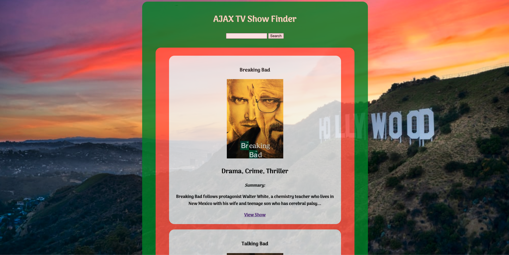

# AJAX TV Show Finder

**In this exercise you will be writing the neccessary code to allow users to search for a TV show from this Web API [TV Maze](https://www.tvmaze.com/api#show-search)**

### Prerequisites

- Able to write and walk through executing Asynchronous Code

- Able to Manipulate and handle events on the DOM

- Familiarilty with basic jQuery

- Basic understanding of AJAX, and using $.get()

_If you need to, review - [Lesson: Asynchronous Code Execution & AJAX](https://docs.google.com/presentation/d/1jTFwPXmyZis1Ab7qKXrTlDC4gsXLB7TG3ZUjlwDPvQI/present)_

### Objectives

By the end of this exercise, you should be able to:

- Use $.get (a.k.a make an AJAX call) to get data from an external URL and pass that data along to another function.

- Be able to modify the DOM API with results from and AJAX call

- Be able to take information from a user interaction and pass that information in to an AJAX call.

### Getting Started

- Fork, then clone down this repo

- Open the `index.html` page in your browser, make sure you have your browser console open.

- Read the comments and use it to formulate your plan to complete the exercise

### Resources

- [$.get](https://api.jquery.com/jQuery.get/)

- [Template Literals for String Substitution](https://developers.google.com/web/updates/2015/01/ES6-Template-Strings)

- [TV Maze API](https://www.tvmaze.com/api#show-search)

- [Selecting Elements with jQuery](https://api.jquery.com/jQuery/#jQuery1)

- [Creating New Elements with jQuery](https://api.jquery.com/jQuery/#jQuery2)

- [Adding Click Events with jQuery](https://api.jquery.com/click/)

- [$.append](https://api.jquery.com/append/)

---

---

### Font

- The font used in this app is from [google fonts](https://fonts.google.com/)
